# Day 1 -  Neural Networks from Scratch

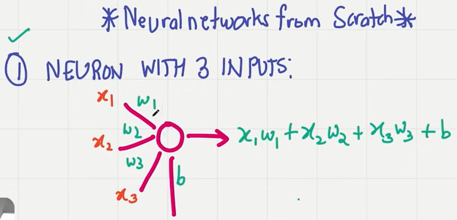

First we see neurons with 3 inputs and next neurons with 4 inputs

input is list, weight is list and then bias is also there. Based on these the calculation is done to get output.

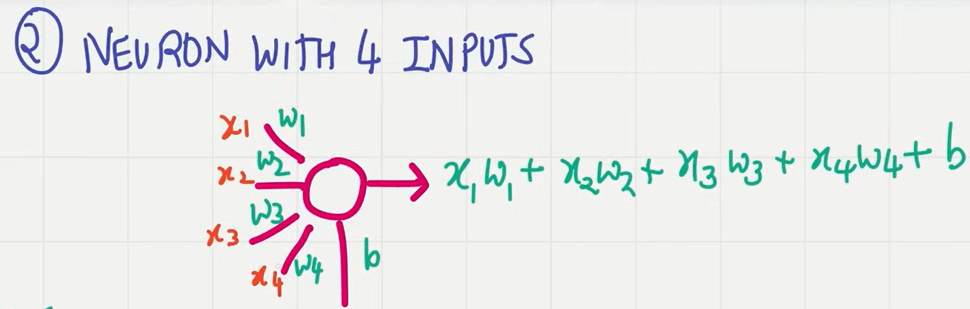

Layer of Neurons - This is where things become tricky. Main power of neurons come from arranging the neurons in layers.

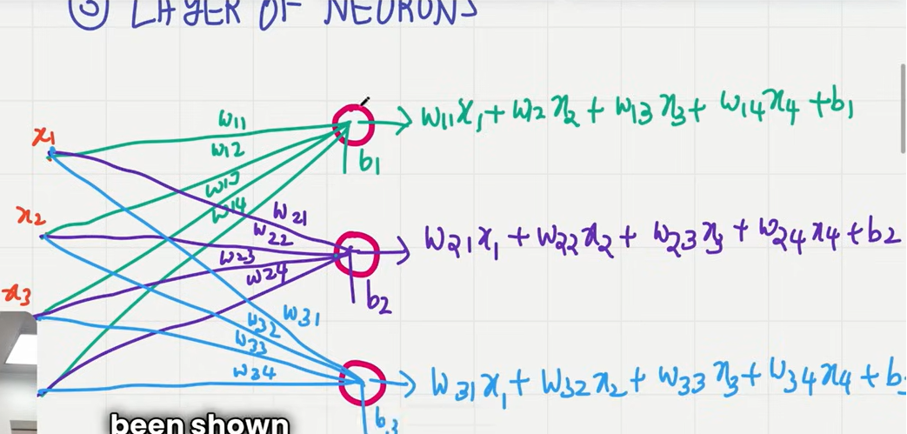

neuron 1, 2 and 3 have inputs and weights associated from these inputs. 4 inputs means 4 weights for a neuron

Whatever we see here is just for 3 neurons and if we have 50 neurons then we cannot just go on writing summation from 50 neurons. So, it is better to use loops

Next we will see why we can use numpy to clculate this

# Day 2 - Code Neurons with Numpy

1. Use numpy to code a neuron

2. Use numpy to code a layer of neurons

3. code a batch of data coming in to a layer of neurons

# Neural Networks with numpy for dotproduct in coding neurons and layers

Numpy is one of the most popular packages for scientific computing in python. Extensively used in neural network modeling.

Dotproduct is important in Neural Networks

np.dot()

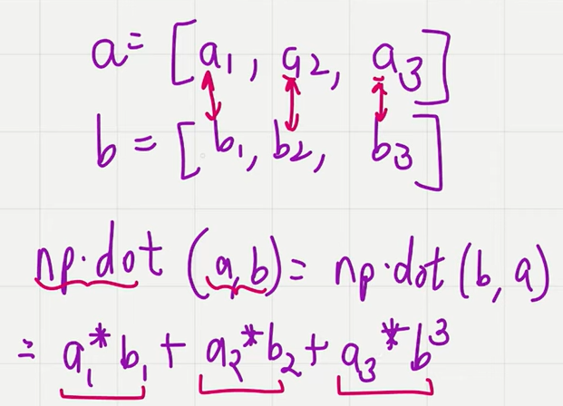

dot product between vector and a matrix. If number of columns in first mtrix is same as number of rows in the second,
then matrix multiplication is possible. output will be 1*3 dimensions

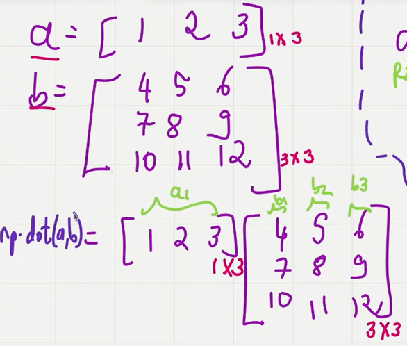
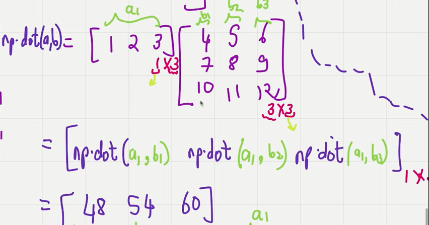

b*a
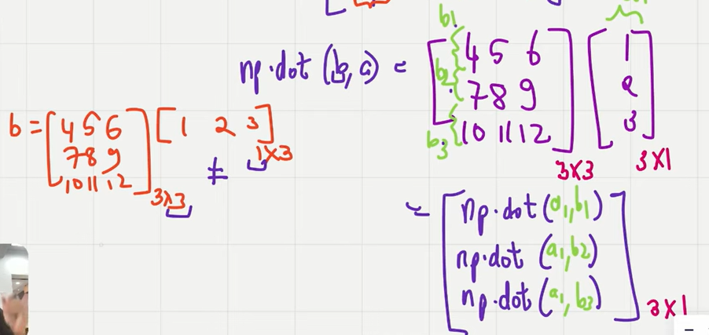

np.dot(a,b) is not equal to np.dot(b,a). for matrix its equal

matrix multiplication

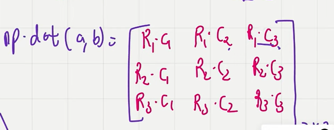

Where dotproduct will be important for each of the cases -

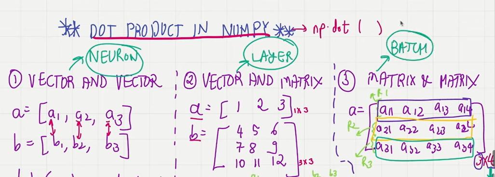

Numpy with single neuron

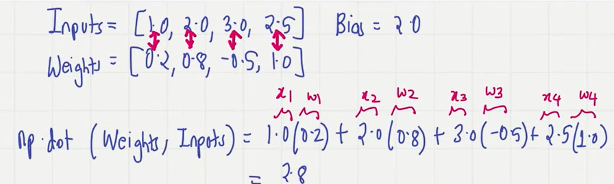

Coding layer of neurons with numpy

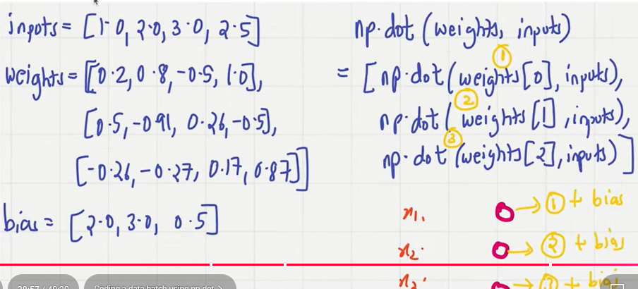

Coding a batch of data coming to a layer with numpy

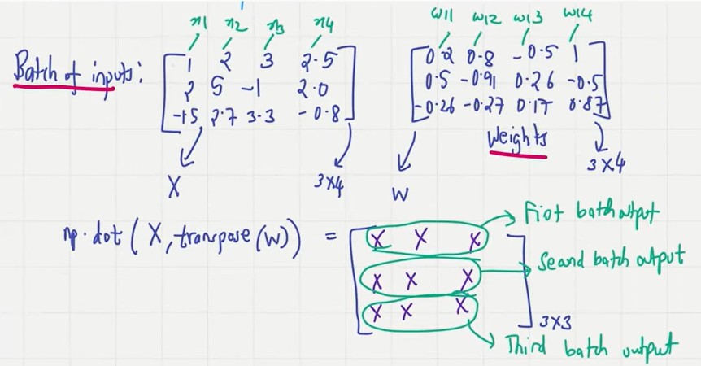

# Day 3 - Coding multiple neural network layers and stcking them together